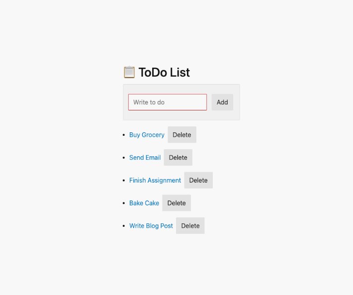

# 📚 React-Redux
[📌 Nomad Coders - 초보자를 위한 리덕스 101 ](https://nomadcoders.co/redux-for-beginners/lobby)
 

## 🔗 Demo

https://kimbro95.github.io/Redux-Study

## 🖥 Preview

## 🔥 Stack

### Front-end

 

## ✅ Packages

- [x] React
- [x] Redux